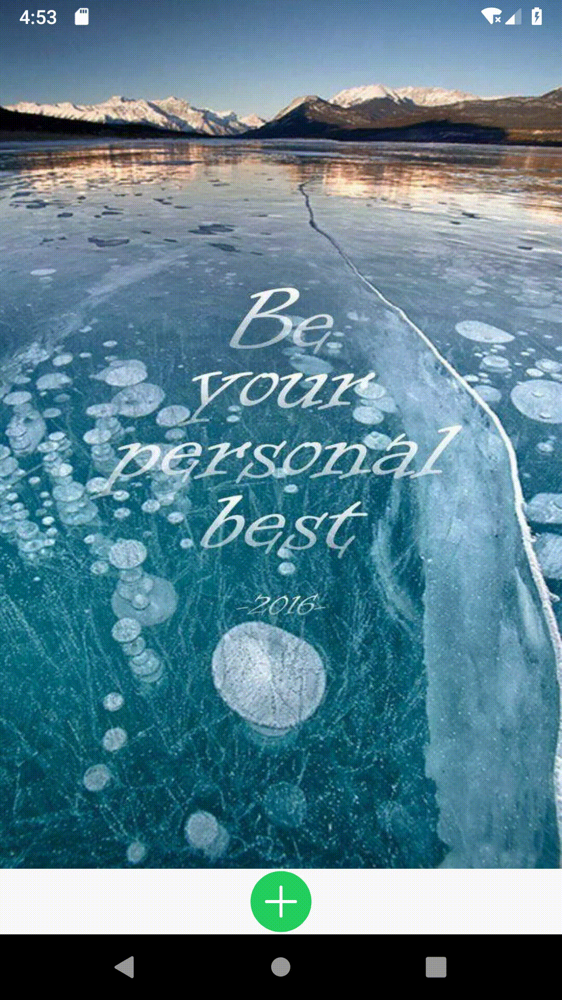

## Demo ScreenShot


## Usage
- Step 1. Add the dependency in the form
```
dependencies {
	implementation 'com.stevexls.widget:bounceview:1.0.0'
}
```

- Step 2.
Look over [Quick Setup](https://github.com/Aspsine/SwipeToLoadLayout/wiki/Quick-Setup) for more details.

## Thanks
- Google SwipeRefreshLayout
- [Android仿微博菜单弹出效果](https://gqdy365.iteye.com/blog/2199256)
- [android 仿微博、酷安点击加号揭露动画弹出菜单+背景模糊效果](https://blog.csdn.net/u012390044/article/details/80746180)

## License

    Copyright 2019 Stevexls. All rights reserved.

    Licensed under the Apache License, Version 2.0 (the "License");
    you may not use this file except in compliance with the License.
    You may obtain a copy of the License at

        http://www.apache.org/licenses/LICENSE-2.0

    Unless required by applicable law or agreed to in writing, software
    distributed under the License is distributed on an "AS IS" BASIS,
    WITHOUT WARRANTIES OR CONDITIONS OF ANY KIND, either express or implied.
    See the License for the specific language governing permissions and
    limitations under the License.
